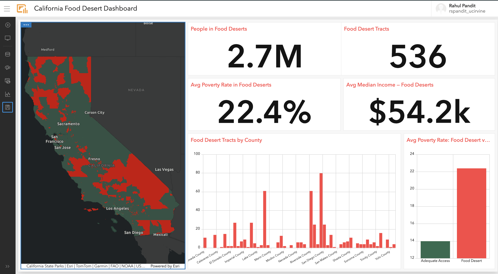
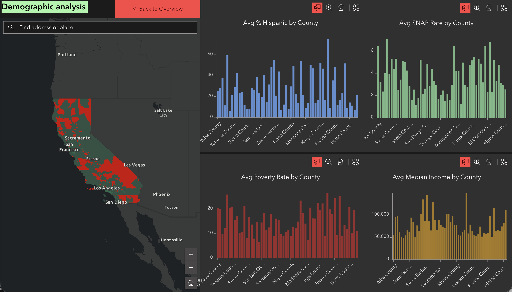

# California Food Desert Analysis — ArcGIS Python Pipeline

Automated data pipeline analyzing food access disparities 
across 8,024 California census tracts using USDA Food Access 
Research Atlas 2019 data.

## What This Does
- Authenticates to ArcGIS Online via OAuth2 (SSO compatible)
- Loads and cleans 72,531 US census tract records (147 fields)
- Filters to California — 8,024 census tracts
- Engineers features: poverty rate, vehicle access, SNAP 
  dependency, demographic breakdowns
- Downloads California tract boundaries from Census Bureau TIGER API
- Merges geometry with food access attributes into GeoJSON
- Publishes hosted feature layer to ArcGIS Online via API

## Key Findings
- 536 food desert census tracts in California (6.7% of all tracts)
- 2.7 million people living in food deserts
- Food desert tracts have 60% higher poverty rates (22.4% vs 14.0%)
- Median income gap: $54K vs $89K
- Hispanic communities disproportionately affected (43.8% vs 35.9%)
- SNAP dependency nearly double (5.2% vs 3.0%)

## Screenshots

## Live Products (open in new tab)
- Dashboard: `https://www.arcgis.com/apps/dashboards/26d4ce294f764a7e8ec24356e19b5124`
- Experience Builder: `https://experience.arcgis.com/experience/9ddbdcd5dbe5410c8c47a0dc6289613d`

## Tech Stack
- Python (pandas, numpy, requests, arcgis)
- ArcGIS API for Python — OAuth2 authentication
- Census Bureau TIGER API — tract boundary download
- ArcGIS Online (Dashboard, Experience Builder)
- Data: USDA ERS Food Access Research Atlas 2019

## Setup
1. Install: `pip install arcgis pandas openpyxl`
2. Register app at uci.maps.arcgis.com to get Client ID
3. Download data from USDA ERS website
4. Run `food_desert_analysis.py`

## Files
- `food_desert_analysis.py` — complete pipeline
- `state_food_access_stats.csv` — state-level aggregation (all US)

## Screenshots

